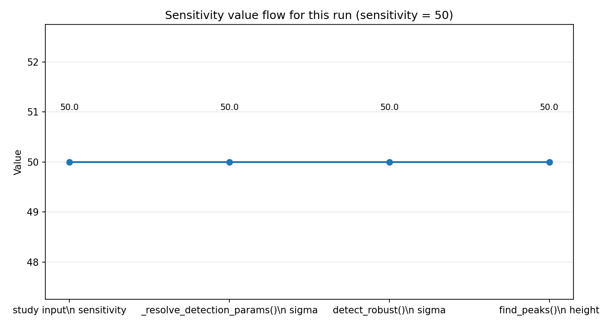
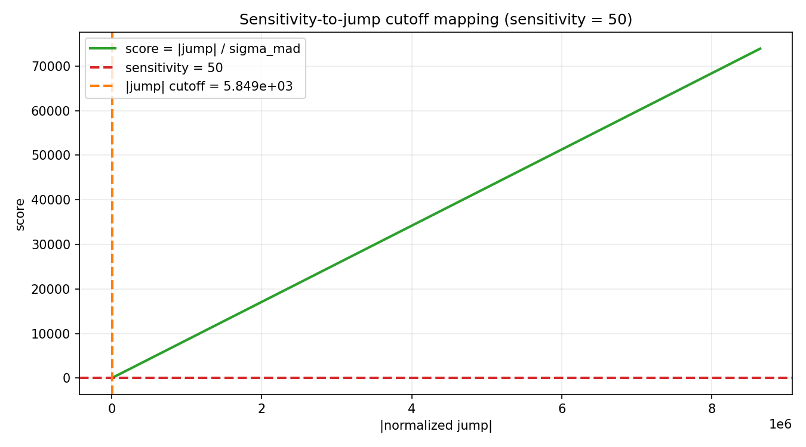
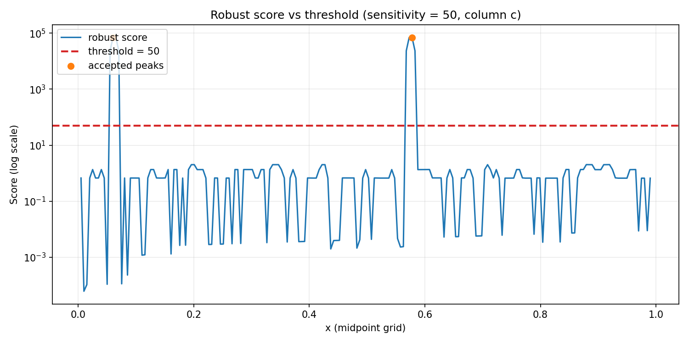
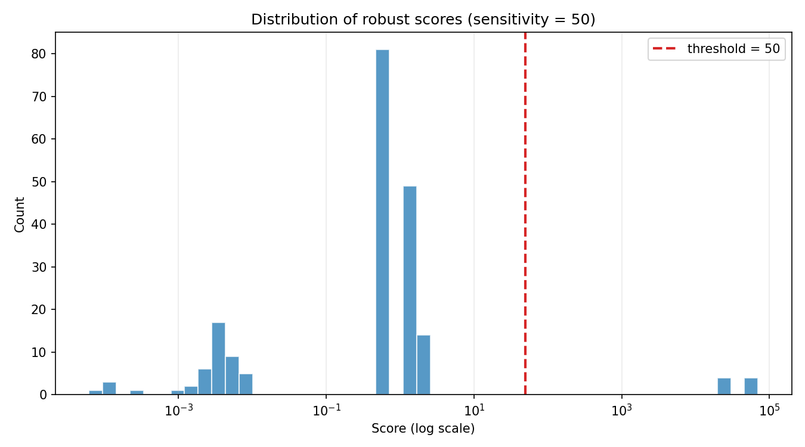
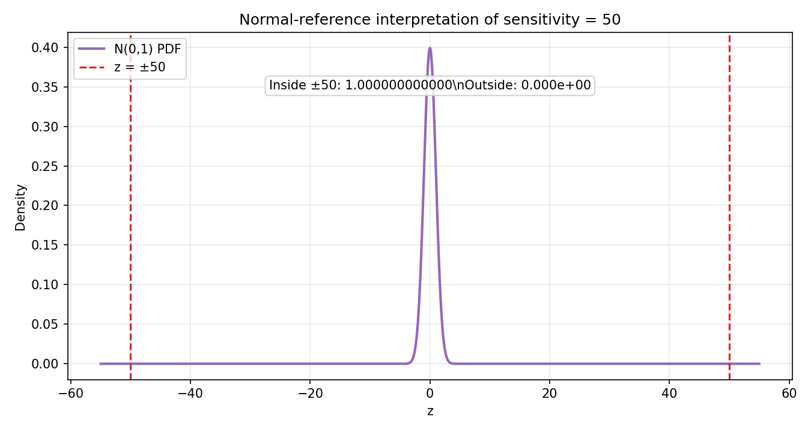

# Sensitivity study (`sensitivity = 50`)

This study repeats the same workflow as `docs/sensitivity_study.md`, but with the threshold set to `50` so we can see how that changes interpretation and gating behavior.

- data: `tests/files/generated_demo_discontinuous.csv`
- analyzed signal: column `c` vs independent column `x`
- detector settings used here: `sensitivity=50`, `min_prominence=20`, `min_separation=3`

## 1. Where the sensitivity value goes

Execution path is unchanged; only the numeric value changes:

1. Study input sets `sensitivity = 50`.
2. `_resolve_detection_params(...)` maps it to detector kwarg `sigma = 50`.
3. `find.detect(...)` forwards `sigma` to `detect_robust(...)`.
4. `detect_robust(...)` applies `find_peaks(..., height=50, ...)`.

| Stage | Value |
| --- | ---: |
| study input sensitivity | 50 |
| resolved `sigma` | 50 |
| `find_peaks` height threshold | 50 |

## 2. How thresholding works mathematically

Robust mode computes:

\[
s_i = \frac{|j_i|}{\sigma_{\text{MAD}}}
\quad\text{with}\quad
\sigma_{\text{MAD}} = 1.4826 \cdot \operatorname{MAD}(j)
\]

and flags peaks where:

\[
s_i \ge \text{sensitivity}
\]

### 2.1 Where `1.4826` comes from

`1.4826` is the Gaussian consistency factor for MAD:

\[
1.4826 \approx \frac{1}{\Phi^{-1}(0.75)} = \frac{1}{0.67448975} = 1.482602...
\]

It rescales MAD into sigma-like units under a normal-reference model.

### 2.2 What that means in this run (`sensitivity=50`)

For this dataset/column (`c`):

- `sigma_mad = 116.98343538365636`
- `jump cutoff = sensitivity * sigma_mad = 5849.171769182818`

So a score must exceed `50` to pass the height gate, which is equivalent to requiring:

\[
|j_i| \ge 5849.171769182818
\]

## 3. Real example behavior (`generated_demo_discontinuous.csv`, column `c`)

Score-series summary (same underlying data, new threshold):

- `score_min = 6.104934796359485e-05`
- `score_median = 0.6738680002615414`
- `score_mean = 1905.697059335918`
- `score_max = 70364.22287232662`

Accepted peaks with `sensitivity=50`:

| Peak index (score grid) | x value | score |
| ---: | ---: | ---: |
| 11 | 0.06030150775 | 70362.83861200664 |
| 114 | 0.5778894475 | 70364.22287232662 |

These are the same dominant fault-driven peaks seen in the `sensitivity=1` study, but now under a much stricter score-height gate.

## 4. Normal-reference interpretation for `sensitivity=50`

If interpreted as a standard normal z-threshold, `±50` is astronomically far into the tails:

- inside `±50`: effectively `1.0` (100% at floating-point precision)
- outside `±50`: effectively `0.0`

This highlights why `sensitivity=50` is conservative: only extremely large robust z-like events survive the height criterion.

## 5. Design note: LUT vs direct threshold, and robust vs plain third derivative

### 5.1 Could sensitivity use a LUT for the first 50 values?

Theoretically yes, but it is usually unnecessary in the current design.

- Today, sensitivity is already a direct threshold on the normalized score axis (`find_peaks(height=sigma)`), so the mapping from user value to compare value is effectively identity.
- Because sensitivity accepts float values (not just integers 1..50), a small LUT would either be restrictive or would still need interpolation/fallback logic.
- A LUT can still be useful for **presets** (for example, `"aggressive"`, `"balanced"`, `"conservative"`) that map to a tuple like `(sensitivity, min_prominence, min_separation)`. That is more valuable than a LUT for sensitivity alone.

So: **possible**, but for this implementation **not the most useful abstraction** unless the goal is preset UX, not numeric conversion.

### 5.2 How this differs from plain third-derivative + fixed threshold

This detector is close in spirit to thresholding a third-derivative-like signal, but adds two critical layers:

1. **Robust normalization**  
   Instead of thresholding raw derivative magnitude, it normalizes by `sigma_mad = 1.4826 * MAD(j)`.  
   This makes thresholds more transferable across scale/unit changes and less sensitive to a few extreme points.

2. **Peak-shape filtering**  
   After height thresholding, it also requires peak prominence and minimum separation.  
   A plain fixed threshold on derivative magnitude tends to over-trigger on noisy bursts and clustered crossings.

Practical consequence:

- plain third-derivative threshold = simpler, but highly scale/noise dependent
- current robust method = slightly more computation, but much more stable across datasets

## 6. Practical takeaway

Moving from `sensitivity=1` to `sensitivity=50` does not change the score computation itself; it only raises the acceptance threshold. For this dataset, the two extreme discontinuity peaks remain far above either threshold, so both settings still detect them. In cleaner or subtler datasets, `50` would suppress many moderate peaks that `1` might pass.
