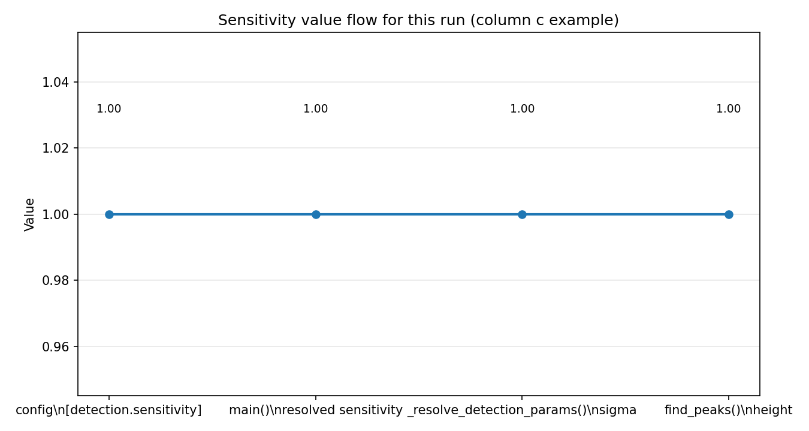
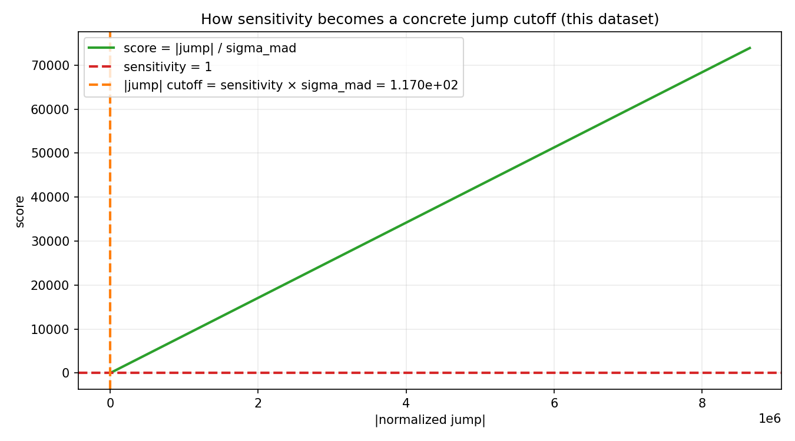
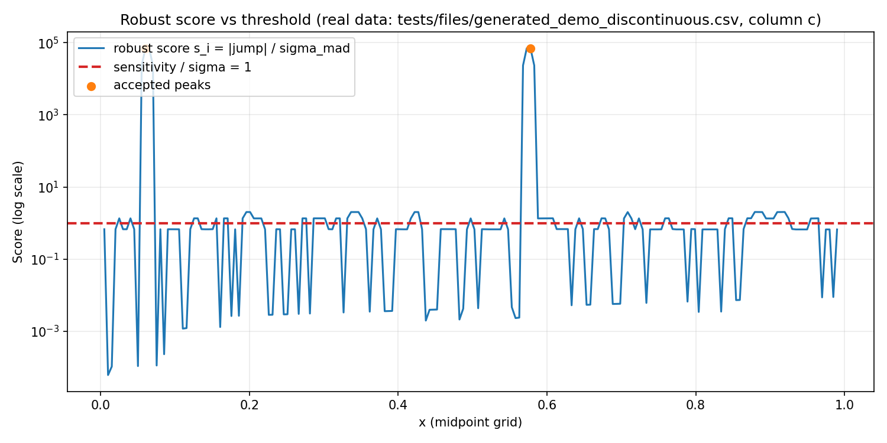
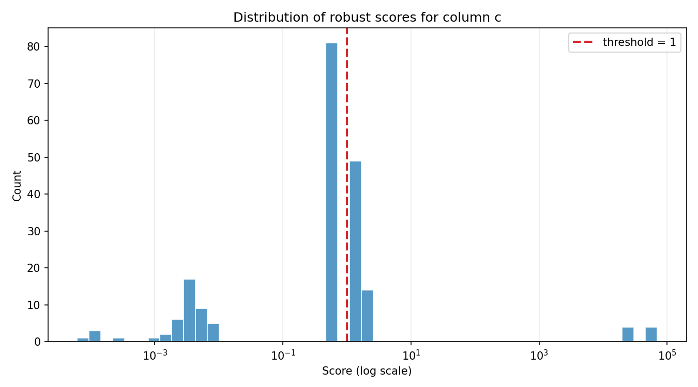
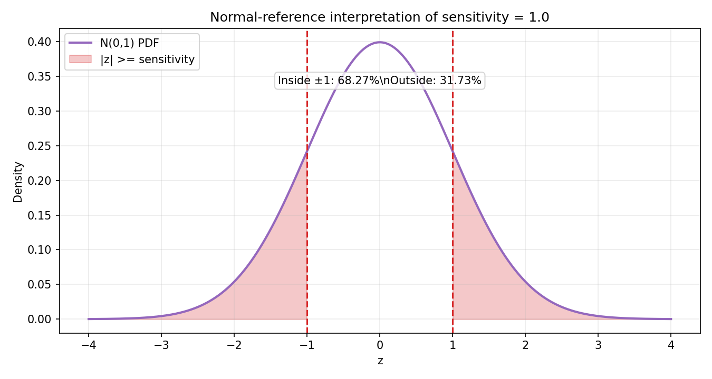

# Sensitivity study (`detection.sensitivity = 1.0`)

This study traces one configured number through execution and shows how it affects detection decisions for:

- config: `tests/generated_data_config.yaml`
- data: `tests/files/generated_demo_discontinuous.csv`
- analyzed signal: column `c` vs independent column `x`

## 1. Where the sensitivity value goes

For this run, the configured value is:

```yaml
detection:
  sensitivity: 1.0
```

Execution path:

1. `main(...)` reads config and resolves `sensitivity` (CLI override would win if provided).
2. `_resolve_detection_params(...)` converts it to `sigma` (float validation, must be `> 0`).
3. `find.detect(...)` passes `sigma` to `detect_robust(...)`.
4. `detect_robust(...)` calls `scipy.signal.find_peaks(..., height=sigma, ...)`.

So in this case the numeric value is effectively passed through unchanged:

| Stage | Value |
| --- | ---: |
| `detection.sensitivity` in YAML | 1.0 |
| resolved `sensitivity` in CLI main path | 1.0 |
| detector kwarg `sigma` | 1.0 |
| `find_peaks` `height` threshold | 1.0 |



## 2. How that threshold is used mathematically

Robust mode computes a score:

\[
s_i = \frac{|j_i|}{\sigma_{\text{MAD}}}
\quad\text{with}\quad
\sigma_{\text{MAD}} = 1.4826 \cdot \operatorname{MAD}(j)
\]

and flags peaks where:

\[
s_i \ge \text{sensitivity}
\]

### 2.1 Where `1.4826` comes from

`1.4826` is the **Gaussian consistency factor for MAD**. It is not tuned from this dataset; it is a fixed constant.

For a standard normal variable \(Z \sim \mathcal{N}(0,1)\):

\[
\operatorname{MAD}(Z) = \operatorname{median}(|Z|) = \Phi^{-1}(0.75) \approx 0.67448975
\]

So to turn MAD into a sigma-consistent scale estimate under Gaussian assumptions:

\[
\sigma \approx \frac{\operatorname{MAD}}{\Phi^{-1}(0.75)}
= \frac{\operatorname{MAD}}{0.67448975}
\approx 1.4826022185 \cdot \operatorname{MAD}
\]

Rounded to 4 decimals, that is **`1.4826`**.

### 2.2 What `1.4826` means in this code path

In `spice_discontinuity/find.py`, the constant appears as:

- `_MAD_TO_SIGMA = 1.4826`
- `sigma_mad = _MAD_TO_SIGMA * _mad(normalized_jump)`

Meaning:

- `_mad(normalized_jump)` gives a robust spread estimate of the jump signal.
- Multiplying by `1.4826` calibrates that spread to sigma-like units (Gaussian-consistent).
- The final score `|jump| / sigma_mad` is therefore a robust z-like score.

For this specific dataset/column (`c`), computed values are:

- `sigma_mad = 116.98343538365636`
- `sensitivity = 1.0`
- implied cutoff on raw jump magnitude: `|j_i| >= sensitivity * sigma_mad = 116.98343538365636`

This is the key transformation: **a unitless sensitivity value turns into a concrete cutoff on the normalized-jump signal through `sigma_mad`.**



## 3. Real example behavior on `generated_demo_discontinuous.csv` (`c` column)

The score series has 197 points (`N-3` with `N=200` input samples).  
With `sensitivity=1.0`, `min_prominence=20.0`, `min_separation=3`, accepted peaks are:

| Peak index (score grid) | x value | score |
| ---: | ---: | ---: |
| 11 | 0.06030150775 | 70362.83861200664 |
| 114 | 0.5778894475 | 70364.22287232662 |

Summary stats for this score series:

- min: `6.104934796359485e-05`
- median: `0.6738680002615414`
- mean: `1905.697059335918`
- max: `70364.22287232662`

The mean is much larger than the median because a small number of extreme discontinuity peaks dominate the tail.





## 4. Normal-distribution interpretation (reference intuition)

If sensitivity is viewed as a standard z-threshold under a standard normal model:

- `sensitivity = 1.0` corresponds to keeping values inside plus/minus 1 sigma
- area inside is ~`68.27%`
- area outside is ~`31.73%`

That intuition is useful for communication, but this detector is **robust-MAD normalized**, not a plain standard-deviation z-score on raw data.



## 5. Design note (aligned with sensitivity=50 study)

For a direct design comparison, see `docs/sensitivity_50_study.md` section 5.

Short version:

- A LUT for sensitivity values is possible, but in the current pipeline sensitivity is already used directly as the normalized height threshold, so a LUT adds little unless used for preset bundles.
- A plain third-derivative + fixed threshold is simpler, but more scale/noise dependent; the current method adds robust MAD normalization plus prominence/separation filtering for better cross-dataset stability.

## 6. Practical takeaway for this configuration

With `sensitivity=1.0`, the score height gate itself is permissive, but final detections still depend strongly on `min_prominence` and `min_separation`. In this example, those additional filters keep detections focused on two very dominant discontinuities.
